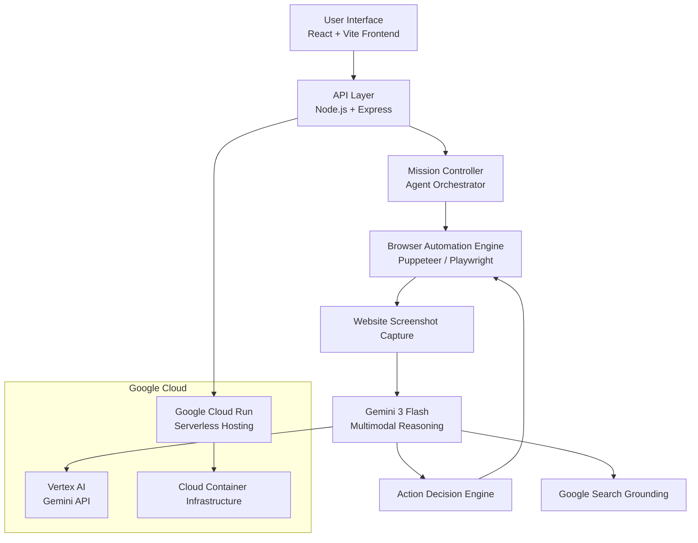
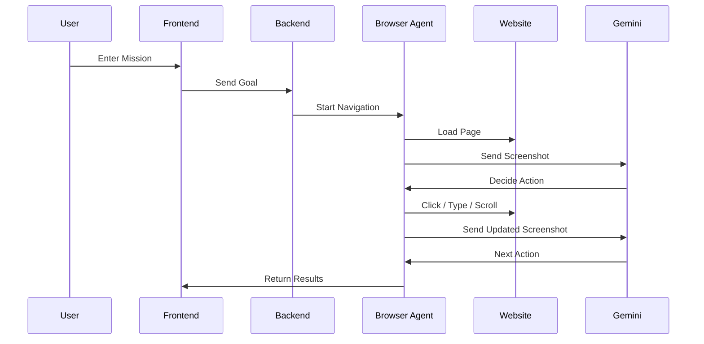

# Universal Web Navigator (UWN)

An **AI-powered autonomous web agent** that can visually understand and navigate websites to complete user-defined tasks using **multimodal reasoning and browser automation**.

Built with **Google Gemini**, **Vertex AI**, and **Google Cloud Run**, UWN represents a new class of **AI agents that don't just answer questions — they interact with the web.**

---

# Inspiration

Modern websites require users to manually search, click, scroll, and navigate through multiple pages to extract information or complete tasks.

While AI assistants can answer questions, they **cannot actually operate websites**.

We asked a simple question:

**What if an AI agent could see websites and operate them like a human?**

Universal Web Navigator was created to demonstrate how **multimodal AI + browser automation + cloud infrastructure** can enable **autonomous web navigation agents**.

---

# What It Does

Universal Web Navigator is an **AI agent that can observe, reason, and act on websites**.

### Visual Web Understanding

The agent captures screenshots of webpages and sends them to **Gemini 3 Flash** for multimodal analysis.

This allows the AI to understand:

* Buttons
* Links
* Forms
* Page layout
* Visual context

---

### Autonomous Web Navigation

Instead of just chatting, the AI can perform actions such as:

* Clicking buttons
* Typing into fields
* Navigating pages
* Extracting information
* Scrolling and exploring content

---

### Mission-Based Interaction

Users define a **goal**, and the agent plans how to achieve it.

Example missions:

* Find the cheapest product
* Navigate to a company careers page
* Extract contact information
* Search and collect data from websites

The AI then executes the steps automatically.

---

# Live Deployment

The application is deployed on **Google Cloud Run**.

Development
[https://ais-dev-ogzzs5mayebfedrbqu3mj4-21713248537.asia-southeast1.run.app](https://ais-dev-ogzzs5mayebfedrbqu3mj4-21713248537.asia-southeast1.run.app)

Production
[https://ais-pre-ogzzs5mayebfedrbqu3mj4-21713248537.asia-southeast1.run.app](https://ais-pre-ogzzs5mayebfedrbqu3mj4-21713248537.asia-southeast1.run.app)

The `.run.app` domain confirms that the application is hosted on **Google Cloud infrastructure**.

---

# Architecture

---

# System Flow

---

# Tech Stack

### Frontend

* React
* Vite
* TypeScript

### Backend

* Node.js
* Express

### AI Engine

* Google Gemini 3 Flash
* Vertex AI Multimodal Reasoning

### Browser Automation

* Puppeteer / Playwright
* Headless Chromium

### Cloud Infrastructure

* Google Cloud Run
* Vertex AI
* Google Search Grounding

---

# Google Cloud Integration

Universal Web Navigator is designed as a **cloud-native AI agent**.

### Google Cloud Run

Used for:

* serverless container deployment
* backend automation service
* scalable agent execution

### Vertex AI

Provides:

* access to Gemini multimodal models
* intelligent reasoning engine
* contextual understanding

### Google Search Grounding

Improves agent accuracy by allowing the model to **verify information against live search results**.

---

# Challenges We Ran Into

### Translating Vision into Action

Websites are visually complex. The AI had to interpret screenshots and translate them into precise browser actions.

---

### Real-Time Reasoning Loop

The agent required a continuous loop:

Observe → Reason → Act

Maintaining this loop with minimal latency was a significant challenge.

---

### Handling Website Variability

Every website has a different structure and layout.

The system had to be **generic enough to work across any website**.

---

### Serverless Browser Automation

Running headless browsers inside **Google Cloud Run containers** required careful optimization.

---

# Accomplishments We're Proud Of

* Built a **true multimodal AI agent**
* Successfully integrated **Gemini + browser automation**
* Deployed a **cloud-native autonomous system**
* Demonstrated **AI-driven web interaction**

---

# What We Learned

During development we gained insights into:

* Designing **AI agent workflows**
* Implementing **multimodal reasoning pipelines**
* Deploying AI applications on **Google Cloud serverless infrastructure**
* Managing **real-time decision loops**

We also learned that **visual context dramatically improves AI navigation capability**.

---

# What's Next

Future improvements include:

### Live Agent Streaming

Allow users to **watch the AI navigate websites in real time**.

---

### Voice Interaction

Enable users to control the agent using **natural speech**.

---

### Persistent Memory

Integrate **Firebase and Firestore** to store:

* mission history
* user preferences
* agent learning data

---

### Advanced Planning Agents

Develop multi-step planning agents capable of handling **complex workflows across multiple websites**.

---

# Potential Applications

Universal Web Navigator could power:

* AI personal assistants
* automated research tools
* digital workflow automation
* accessibility solutions
* enterprise web automation

---

# License

MIT License

 